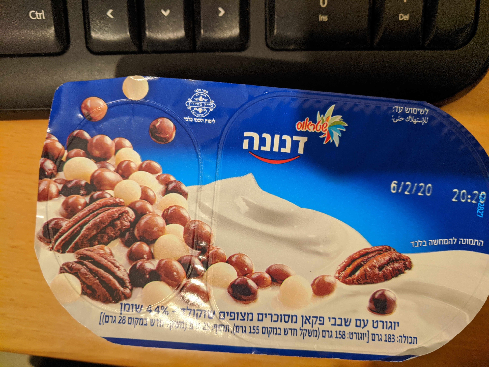
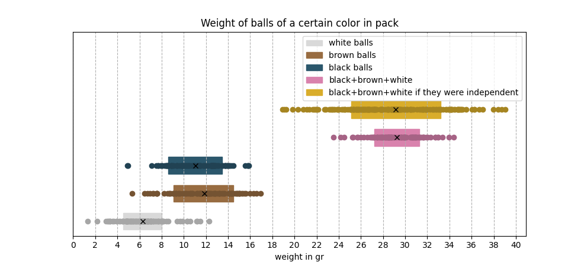
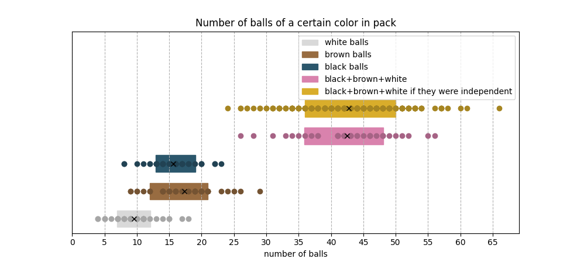
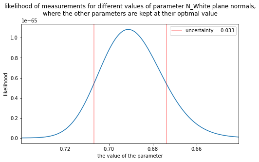
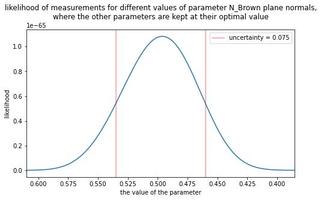
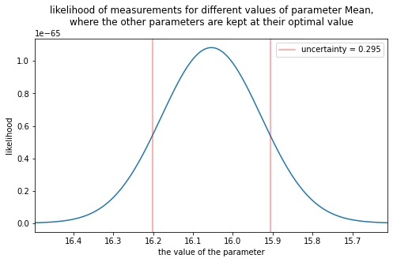
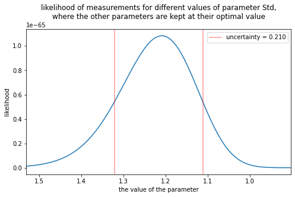
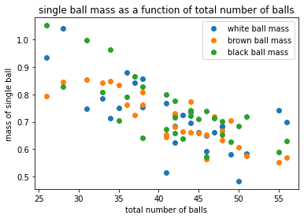

back in 2020 in the idf, they would give us free yogurts once a day. the yogurts were this brand that has these chocolate balls, that came in three colors:

after a few days, I started to suspect that the chocolate balls on the image that is on the package, were not indicative of the typical distribution of balls that you actually get. so I decided to start counting and measuring the balls in the packages in order to do some analyses later. at first for each package I counted the number of balls of each color, and measured the collective mass of each color. so for each package I collected 6 numbers. at some point I got lazy and decided to skip counting the balls, and only measured the mass of each color.

here is the data I got:

```
Nw,Ww,Nb,Wb,Nk,Wk
5,6.15,21,17.31,16,15.45
7,8.31,19,17.51,12,10.72
15,10.28,21,15.79,14,12.59
15,10.74,10,9.48,16,15.83
5,6.95,17,17.36,11,11.91
8,10.06,14,13.68,14,14.1
4,6.4,21,18.24,12,13.42
9,12.4,9,10.63,10,11.3
11,11.04,14,13.24,17,14.23
10,11.6,15,15.13,13,13.8
9,9.31,24,16.67,23,17.49
7,7.82,19,16.7,16,14.5
9,9.18,23,18.34,16,14.27
10,9.54,17,12.59,19,17.05
12,10.03,26,18,13,12.36
7,7.89,15,14.62,22,18.9
11,11.11,20,16.24,13,12.69
9,9.79,9,10.54,17,15
4,6,29,19,22,16
18,15.3,12,10.62,18,14.76
11,10.86,15,15.73,8,10.73
6,8.63,12,12.54,8,11.44
7,8.27,10,11.56,14,16.98
17,14.25,16,14.55,14,13.01
9,8.98,16,13.58,20,17.21
14,11.18,20,17.14,15,12.42
11,9.55,20,16.06,15,11.62
11,11.01,14,12.32,18,14.52
10,10.71,11,10.22,20,16.5
#N/A,8.71,#N/A,15.34,#N/A,15.53
#N/A,8.39,#N/A,14.92,#N/A,12.97
#N/A,10.23,#N/A,15.65,#N/A,12.81
#N/A,14.53,#N/A,11.25,#N/A,14.32
#N/A,8.43,#N/A,11.83,#N/A,16.68
#N/A,9.43,#N/A,18.03,#N/A,12.44
#N/A,5.22,#N/A,15.4,#N/A,15.49
#N/A,9.38,#N/A,11.75,#N/A,15.65
#N/A,9.45,#N/A,13.76,#N/A,15.8
#N/A,9.62,#N/A,13.82,#N/A,14.57
#N/A,9.35,#N/A,13.6,#N/A,13.22
#N/A,7.86,#N/A,17.28,#N/A,11.97
#N/A,7.31,#N/A,17.12,#N/A,13.4
#N/A,14.19,#N/A,9.95,#N/A,12.84
#N/A,10.43,#N/A,14.57,#N/A,12.83
#N/A,7.51,#N/A,15.88,#N/A,16.19
#N/A,9.01,#N/A,19.61,#N/A,11.61
#N/A,8.17,#N/A,12.33,#N/A,17.15
#N/A,7.18,#N/A,14.48,#N/A,13.12
#N/A,9.81,#N/A,15.05,#N/A,15.93
#N/A,6.72,#N/A,15.27,#N/A,15.55
#N/A,7.56,#N/A,15.09,#N/A,13.99
#N/A,8.26,#N/A,17.1,#N/A,13.4
#N/A,6.35,#N/A,17.41,#N/A,----
#N/A,9.93,#N/A,14.21,#N/A,15.79
#N/A,9.16,#N/A,17.8,#N/A,16.1
#N/A,10.53,#N/A,14.64,#N/A,16.84
#N/A,13.59,#N/A,13.3,#N/A,15.58
#N/A,8.46,#N/A,12.32,#N/A,18.87
#N/A,8.82,#N/A,15.84,#N/A,12.96
#N/A,11.12,#N/A,15.12,#N/A,11.46
#N/A,8.02,#N/A,13.44,#N/A,18.58
#N/A,9.69,#N/A,15.48,#N/A,11.42
#N/A,7.9,#N/A,14.62,#N/A,15.21
#N/A,7.52,#N/A,17.65,#N/A,14.84
#N/A,10.71,#N/A,10.26,#N/A,15.61
#N/A,13.36,#N/A,12.72,#N/A,11.61
#N/A,9.28,#N/A,17.38,#N/A,13.76
#N/A,7.89,#N/A,19.31,#N/A,11.9
#N/A,9.8,#N/A,9.76,#N/A,16.76
#N/A,10.06,#N/A,17.13,#N/A,11.9
#N/A,10.02,#N/A,18.65,#N/A,11.1
#N/A,6.62,#N/A,14.3,#N/A,17.34
#N/A,9.39,#N/A,18.54,#N/A,11.04
#N/A,8.95,#N/A,17.82,#N/A,7.96
#N/A,10.27,#N/A,11.75,#N/A,11.58
#N/A,7.83,#N/A,14.26,#N/A,16.8
#N/A,10.07,#N/A,14.52,#N/A,15.75
#N/A,6.19,#N/A,17.14,#N/A,14.46
#N/A,13.33,#N/A,12.03,#N/A,10.58
#N/A,12.92,#N/A,16.44,#N/A,7.95
#N/A,4.36,#N/A,16.55,#N/A,18.77
#N/A,8.5,#N/A,10.59,#N/A,16.57
#N/A,9.73,#N/A,13.8,#N/A,11.55
#N/A,7.91,#N/A,19.96,#N/A,13.25
#N/A,8.05,#N/A,17.9,#N/A,14
#N/A,7.92,#N/A,15.5,#N/A,10.95
#N/A,8.8,#N/A,18.04,#N/A,10.1
#N/A,9.79,#N/A,16.24,#N/A,12.06
#N/A,9.68,#N/A,15.25,#N/A,15.76
#N/A,7.89,#N/A,8.37,#N/A,17
#N/A,9.14,#N/A,15.02,#N/A,15.58
#N/A,12.69,#N/A,12.13,#N/A,12.08
#N/A,11.45,#N/A,12.11,#N/A,13.95
#N/A,6.97,#N/A,15.02,#N/A,15.48
```

now, in order to calculate p values, I need some statistical model.

# Statistical Models

the way I see it, there are two ways these packages might be created in the factory.

1) there are distinct black, brown and white dispensers each of which dispense the chocolate balls into the cup independently.

2) the black, brown, and white balls are mixed together in some container, and then dispensed from that container into the cups.

note that for model (1) to be true, the mass/number of balls in each color has to be independent. after some analysis, it is easy to see that this is not the case, leaving us with statistical model number (2)

|||
|:---:|:--:|
||
||

as can be seen in the above figure, there is an uncertainty of 7% in the total weight of chocolate in a package. which in clearer terms means there is exactly a 32% chance that the total amount of chocolate in the box will be either larger by more than 7%, than the average, or smaller by less than 7% than the average.

## model parameters

so the model we basically have is that the total masses are distributed normally around some linear plane, and the colors also have a Multinomial distribution:

$$
\rho(W) = A(W)\cdot{B(W)}
$$
where A is the distribution of the total volume of the chocolates and B is the Multinomial distribution of the relative amounts of different colors:
$$
d(W) = \frac{W\cdot N-Mean}{Std}
$$
$$
A(W) = \frac{1}{\sqrt{2\pi}\cdot Std}\exp\bigg(-\frac{d(W)^2}{2}\bigg)
$$
where W is the vector of the weights of the three colors. and N is the normal that defines the plane.
$$
B(W) = \frac{\Gamma(1+W_{sum})}{\Pi_i(\Gamma(1+W_{i})}\Pi_i p_i^{W_i}
$$
where $p_i$ is the expected ratio of each color:

```
p_w = 0.21896850868981296
p_b = 0.40271531669606014
p_k = 0.37831617461412687
```

note that this plane has some nontrivial incline because the different colors of chocolate have different densities, and the dispenser is most likely to dispense a relatively constant volume, whilst I measured the mass of the chocolates.

now we can apply this model to the data set and see which parameters maximize the likelihood. the likelihood's maximum as achieved at:

```
Nw = 0.69125
Nb = 0.49612
NK = 0.52540
mean = 16.05308
std = 1.20868
```

around this point we can draw four 1d plots:
|||
|:---:|:--:|
|||
|||
in these plots the red lines indicate the x values at which the likelihood drops to one half. I take the interval between the two red lines to be the uncertainty I have in the parameters. so to sum up:
$$
d(W) = \frac{W\cdot N-Mean}{Std}
$$
$$
\rho(W) =\frac{1}{\sqrt{2\pi}\cdot Std}\exp\bigg(-\frac{d(W)^2}{2}\bigg)
$$

```
Nw = 0.69125 ± 0.033
Nb = 0.49612 ± 0.075
NK = 0.52540 ± 0.04
mean = 16.05308 ± 0.3
std = 1.20868 ± 0.21
```

we can take the edge cases of this plane and calculate the mass of each ball color that is required to fill the cup:

```
Ww_fill = 23
Wb_fill = 32
Wk_fill = 31
```

notice the major difference in density between the light and dark chocolates. after some research I found that this 40% difference in density could be explained by the differences in fat and filler contents in the chocolates.

# map number of balls to mass of balls

given a number of each color of balls in a package, we would like a mapping that gives us the total mass of each color-group of balls. the most trivial relation is that the two should be proportional to one another. the ratio of total color-group mass to number of balls in color-group is called "single ball mass". here I plot single ball mass as a function of the total number of balls (total number of balls is total of all colors):


to this data I fit a plane:
$$
\vec{M}_\mu=\vec{N}\big(a+\vec{R}\cdot\vec{N}\big)
$$
and find the best a,Rw,Rb,Rk values. Rw,Rb and Rk turned out to be pretty much identical. thus I decided to assume they are identical.

the probability model that corrisponds to this is a simple 3d normal distribution around $\vec{M}_\mu$. that is:
$$
\vec{M}_\mu=\vec{N}\big(a+\vec{R}\cdot\vec{N}\big)
$$
$$
\rho = \Pi_i \frac{1}{\sqrt{2\pi}\cdot \text{Std}}\exp\bigg(\big((M_i - M_i\mu)/\text{Std}\big)^2\bigg)
$$
from finding the parameters with the maximal likelihood we get:
```
    std = 0.91656
    a = 1.164
    R = 0.0107
```
here are some figures:


# P-Value of the image on the package


